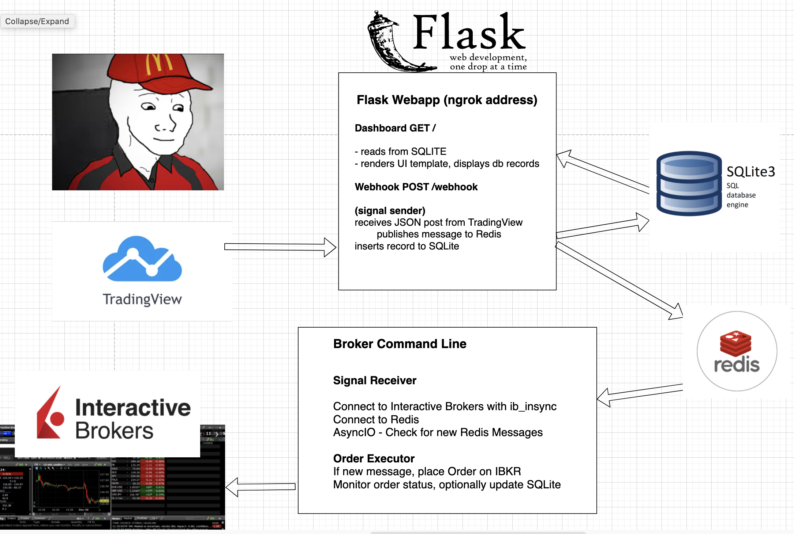

# tradingview-interactive-brokers
TradingView Interactive Brokers Integration using Webhooks

## Demo Video:

https://www.youtube.com/watch?v=zsYKfzCNPPU

## Support My Work

__Visit Interactive Brokers__

https://www.interactivebrokers.com/mkt/?src=ptlg&url=%2Fen%2Findex.php%3Ff%3D1338

__Buy Me a Coffee__

https://buymeacoffee.com/parttimelarry

## Diagram 



## Prerequisites

* Requires redis, Python3, and packages installed

```
pip3 install -r requirements.txt

export FLASK_APP=webapp
export FLASK_ENV=development
flask run
```

## References, Tools, and Libraries Used:

* ngrok - https://ngrok.com - provides tunnel to localhost
* Flask - https://flask.palletsprojects.com/ - webapp
* Redis - https://pypi.org/project/redis/ - Redis client for Python
* ib_insync - https://ib-insync.readthedocs.io
* Redis pubsub - https://www.twilio.com/blog/sms-microservice-python-twilio-redis-pub-sub, https://redislabs.com/ebook/part-2-core-concepts/chapter-3-commands-in-redis/3-6-publishsubscribe/
* asyncio snippet - https://stackoverflow.com/questions/54153332/schedule-asyncio-task-to-execute-every-x-seconds
* ib_insyc examples - https://github.com/hackingthemarkets/interactive-brokers-demo/blob/main/order.py
